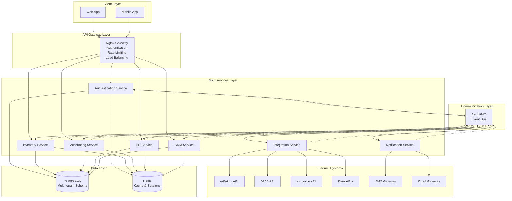

# Components

Based on the architectural patterns, tech stack, and data models, here are the major logical components:

## API Gateway

**Responsibility:** Single entry point for all client requests, routing, authentication, and load balancing

**Key Interfaces:**
- HTTP/HTTPS endpoints for external access
- Authentication middleware with JWT validation
- Rate limiting and request throttling
- Request routing to appropriate microservices
- SSL/TLS termination
- CORS handling for Indonesian cross-origin requirements

**Dependencies:** Nginx, Redis (for rate limiting), Authentication Service

**Technology Stack:** Nginx 1.25.5 with custom configuration, Lua scripting for complex routing rules

## Authentication Service

**Responsibility:** User authentication, authorization, and session management for multi-tenant Indonesian MSMEs

**Key Interfaces:**
- POST /auth/login - User authentication
- POST /auth/logout - Session termination
- POST /auth/refresh - Token refresh
- GET /auth/profile - User profile retrieval
- POST /auth/register - New user registration
- Internal APIs for service-to-service authentication

**Dependencies:** PostgreSQL, Redis, RabbitMQ

**Technology Stack:** Go 1.23.1, Gin 1.9.1, GORM 1.25.10, JWT 1.2.1, bcrypt for password hashing

## Inventory Service

**Responsibility:** Product catalog management, stock tracking, and inventory operations for Indonesian MSMEs

**Key Interfaces:**
- CRUD operations for Products, Categories, Warehouses
- Stock adjustment and tracking APIs
- Low stock alerts and reordering suggestions
- Inventory reporting and analytics
- Barcode scanning support
- Multi-warehouse management

**Dependencies:** PostgreSQL, Redis (caching), RabbitMQ (events)

**Technology Stack:** Go 1.23.1, Gin 1.9.1, GORM 1.25.10, Redis 7.2.5

## Accounting Service

**Responsibility:** Financial transaction management, Indonesian tax compliance, and accounting operations

**Key Interfaces:**
- Transaction CRUD operations
- Invoice generation with Indonesian tax compliance
- Payment processing and tracking
- Financial reporting (P&L, Balance Sheet)
- Tax calculation and reporting (PPN 11%)
- Account reconciliation
- BPJS calculations and deductions

**Dependencies:** PostgreSQL, Redis, RabbitMQ, External Indonesian APIs

**Technology Stack:** Go 1.23.1, Gin 1.9.1, GORM 1.25.10, custom Indonesian tax calculation library

## HR Service

**Responsibility:** Employee management, payroll processing, and BPJS social security integration

**Key Interfaces:**
- Employee data management
- Payroll calculation and processing
- BPJS contribution calculations
- Attendance and leave management
- Employee performance tracking
- Indonesian tax calculations for payroll

**Dependencies:** PostgreSQL, Redis, RabbitMQ, BPJS API

**Technology Stack:** Go 1.23.1, Gin 1.9.1, GORM 1.25.10, BPJS API client library

## CRM Service

**Responsibility:** Customer relationship management, sales tracking, and customer analytics

**Key Interfaces:**
- Customer data management
- Sales order processing
- Customer communication tracking
- Sales pipeline management
- Customer analytics and reporting
- Marketing campaign management

**Dependencies:** PostgreSQL, Redis, RabbitMQ

**Technology Stack:** Go 1.23.1, Gin 1.9.1, GORM 1.25.10

## Integration Service

**Responsibility:** External API integrations for Indonesian government compliance and third-party services

**Key Interfaces:**
- e-Faktur API integration for tax compliance
- BPJS API integration for social security
- Bank API integrations for payments
- e-Invoice API integration
- Third-party service APIs (GoTo, e-wallets)
- Data synchronization and retry logic

**Dependencies:** RabbitMQ, External Indonesian APIs, Redis

**Technology Stack:** Go 1.23.1, custom HTTP clients with circuit breaker pattern

## Notification Service

**Responsibility:** Multi-channel notifications for Indonesian MSME business operations

**Key Interfaces:**
- Email notifications (transaction confirmations, alerts)
- SMS notifications for Indonesian mobile numbers
- In-app notifications
- Push notifications for mobile apps
- Notification templates and localization (Indonesian/English)

**Dependencies:** Redis, RabbitMQ, External SMS/Email providers

**Technology Stack:** Go 1.23.1, email/SMS client libraries, template engine

## Component Diagrams

