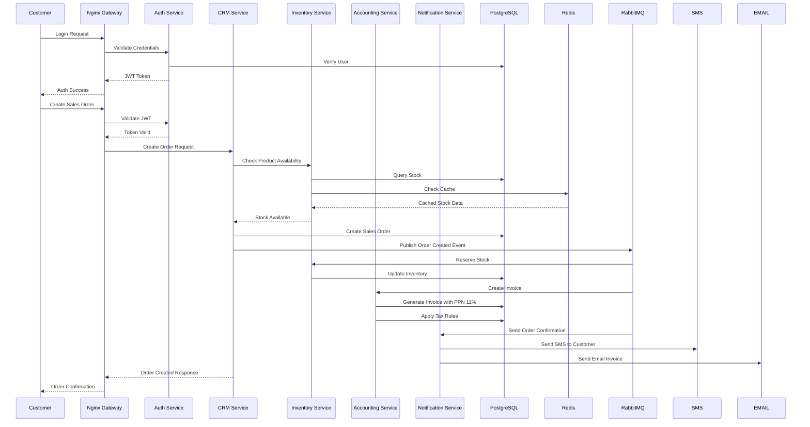
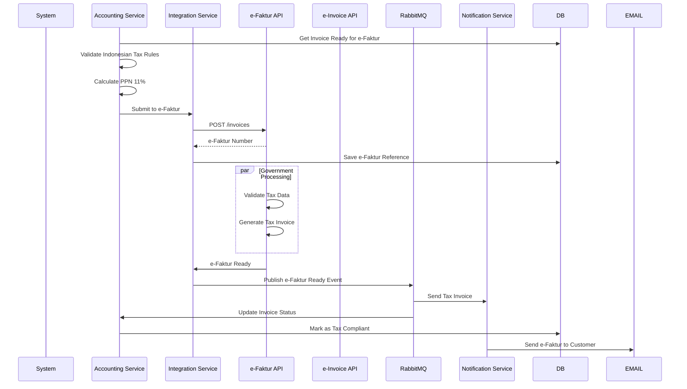
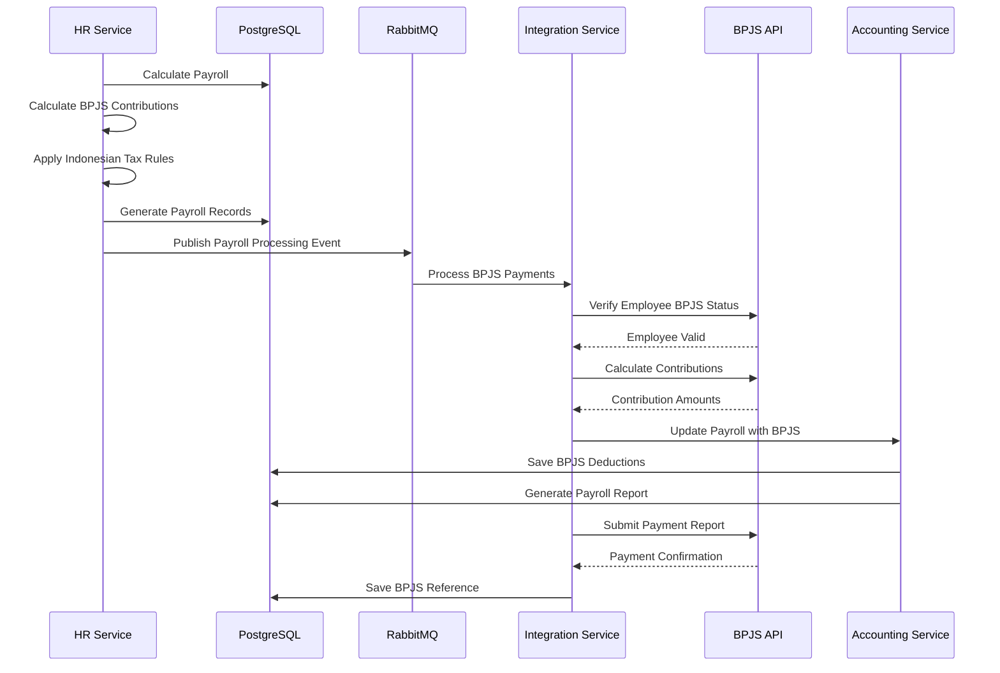
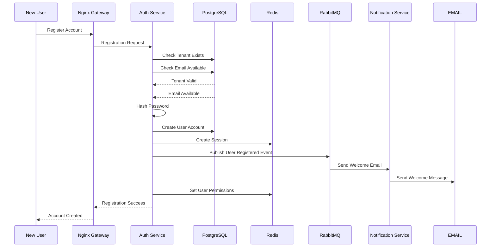

# Core Workflows

## Customer Sales Transaction Flow

```mermaid
sequenceDiagram
    participant C as Customer
    participant G as Nginx Gateway
    participant A as Auth Service
    participant CRM as CRM Service
    participant INV as Inventory Service
    participant ACC as Accounting Service
    participant N as Notification Service
    participant DB as PostgreSQL
    participant R as Redis
    participant MQ as RabbitMQ

    C->>G: Login Request
    G->>A: Validate Credentials
    A->>DB: Verify User
    A-->>G: JWT Token
    G-->>C: Auth Success

    C->>G: Create Sales Order
    G->>A: Validate JWT
    A-->>G: Token Valid
    G->>CRM: Create Order Request

    CRM->>INV: Check Product Availability
    INV->>DB: Query Stock
    INV->>R: Check Cache
    R-->>INV: Cached Stock Data
    INV-->>CRM: Stock Available

    CRM->>DB: Create Sales Order
    CRM->>MQ: Publish Order Created Event

    MQ->>INV: Reserve Stock
    INV->>DB: Update Inventory
    MQ->>ACC: Create Invoice
    ACC->>DB: Generate Invoice with PPN 11%
    ACC->>DB: Apply Tax Rules
    MQ->>N: Send Order Confirmation

    N->>SMS: Send SMS to Customer
    N->>EMAIL: Send Email Invoice

    CRM-->>G: Order Created Response
    G-->>C: Order Confirmation
```

## Indonesian Tax Compliance Workflow

```mermaid
sequenceDiagram
    participant SYS as System
    participant ACC as Accounting Service
    participant INTEG as Integration Service
    participant EF as e-Faktur API
    participant EINV as e-Invoice API
    participant MQ as RabbitMQ
    participant N as Notification Service

    ACC->>DB: Get Invoice Ready for e-Faktur
    ACC->>ACC: Validate Indonesian Tax Rules
    ACC->>ACC: Calculate PPN 11%
    ACC->>INTEG: Submit to e-Faktur

    INTEG->>EF: POST /invoices
    EF-->>INTEG: e-Faktur Number
    INTEG->>DB: Save e-Faktur Reference

    par Government Processing
        EF->>EF: Validate Tax Data
        EF->>EF: Generate Tax Invoice
    end

    EF->>INTEG: e-Faktur Ready
    INTEG->>MQ: Publish e-Faktur Ready Event

    MQ->>N: Send Tax Invoice
    MQ->>ACC: Update Invoice Status

    ACC->>DB: Mark as Tax Compliant
    N->>EMAIL: Send e-Faktur to Customer
```

## BPJS Payroll Processing Workflow

```mermaid
sequenceDiagram
    participant HR as HR Service
    participant DB as PostgreSQL
    participant MQ as RabbitMQ
    participant INTEG as Integration Service
    participant BPJS as BPJS API
    participant ACC as Accounting Service

    HR->>DB: Calculate Payroll
    HR->>HR: Calculate BPJS Contributions
    HR->>HR: Apply Indonesian Tax Rules
    HR->>DB: Generate Payroll Records

    HR->>MQ: Publish Payroll Processing Event
    MQ->>INTEG: Process BPJS Payments

    INTEG->>BPJS: Verify Employee BPJS Status
    BPJS-->>INTEG: Employee Valid
    INTEG->>BPJS: Calculate Contributions
    BPJS-->>INTEG: Contribution Amounts

    INTEG->>ACC: Update Payroll with BPJS
    ACC->>DB: Save BPJS Deductions
    ACC->>DB: Generate Payroll Report

    INTEG->>BPJS: Submit Payment Report
    BPJS-->>INTEG: Payment Confirmation
    INTEG->>DB: Save BPJS Reference
```

## Multi-tenant User Registration Flow

```mermaid
sequenceDiagram
    participant USER as New User
    participant G as Nginx Gateway
    participant AUTH as Auth Service
    participant DB as PostgreSQL
    participant R as Redis
    participant MQ as RabbitMQ
    participant N as Notification Service

    USER->>G: Register Account
    G->>AUTH: Registration Request
    AUTH->>DB: Check Tenant Exists
    AUTH->>DB: Check Email Available

    DB-->>AUTH: Tenant Valid
    DB-->>AUTH: Email Available
    AUTH->>AUTH: Hash Password
    AUTH->>DB: Create User Account
    AUTH->>R: Create Session

    AUTH->>MQ: Publish User Registered Event
    MQ->>N: Send Welcome Email

    N->>EMAIL: Send Welcome Message
    AUTH->>R: Set User Permissions

    AUTH-->>G: Registration Success
    G-->>USER: Account Created
```
