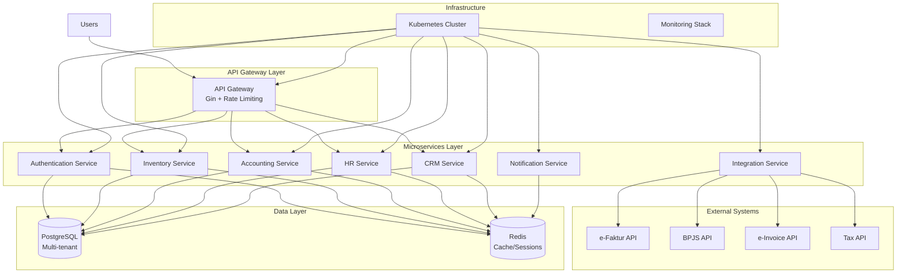

# High Level Architecture

## Technical Summary

RexiERP is a cloud-native microservices architecture built on Go that provides comprehensive business management for Indonesian MSMEs. The system uses domain-driven design with separate services for core business functions (inventory, accounting, HR, CRM), connected via REST APIs and event-driven messaging. PostgreSQL databases provide transactional integrity, Redis enables caching and session management, and containerized deployment ensures scalability across multiple cloud providers while maintaining zero software licensing costs.

## High Level Overview

**Architectural Style:** Microservices with Domain-Driven Design (DDD)

**Repository Structure:** Monorepo (as decided in PRD) with separate service directories

**Service Architecture:**
- Core business services: Inventory, Accounting, HR, CRM
- Cross-cutting services: Authentication, Notification, Integration
- API Gateway for unified access point

**Primary User Flow:**
1. User authenticates via API Gateway
2. Requests routed to appropriate microservice
3. Services communicate via REST APIs and async messaging (RabbitMQ)
4. Data persisted in PostgreSQL with Redis caching
5. External Indonesian APIs integrated for compliance

**Key Architectural Decisions:**
- **Microservices:** Enables independent scaling and deployment of business domains
- **Go + Gin:** Zero-cost licensing, excellent performance, Indonesian developer familiarity
- **PostgreSQL:** Open-source, ACID compliance for financial data, mature ecosystem
- **Redis:** Zero-cost caching, Indonesian cloud provider support
- **Monorepo:** Simplifies dependency management and deployment coordination

## High Level Project Diagram

## Architectural and Design Patterns

**Recommended Patterns:**

- **Domain-Driven Design (DDD):** Bounded contexts for each business domain (Inventory, Accounting, HR, CRM) - _Rationale:_ Clean separation of concerns, aligns with microservices, handles Indonesian business complexity

- **Repository Pattern:** Abstract data access with GORM interfaces - _Rationale:_ Enables testing, database migration flexibility, cleaner service logic

- **Event-Driven Architecture:** RabbitMQ for async communication - _Rationale:_ Service decoupling, better scalability, Indonesian compliance event handling

- **API Gateway Pattern:** Single entry point with authentication/routing - _Rationale:_ Simplifies client access, centralized security, Indonesian compliance enforcement

- **CQRS (Command Query Responsibility Segregation):** Separate read/write models for complex queries - _Rationale:_ Performance optimization for reporting, audit trail requirements for Indonesian taxes

- **Circuit Breaker Pattern:** Fault tolerance for external Indonesian APIs - _Rationale:_ Handles unreliable government APIs, prevents cascading failures

- **Multi-tenant Pattern:** Schema-based tenant isolation - _Rationale:_ Cost efficiency for MSME market, data isolation compliance
